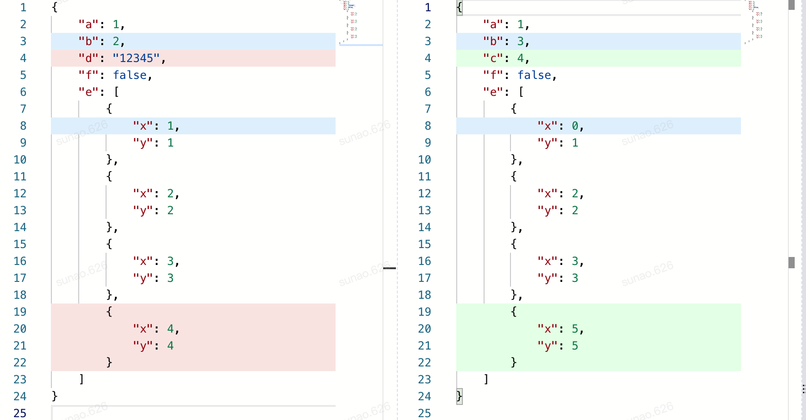
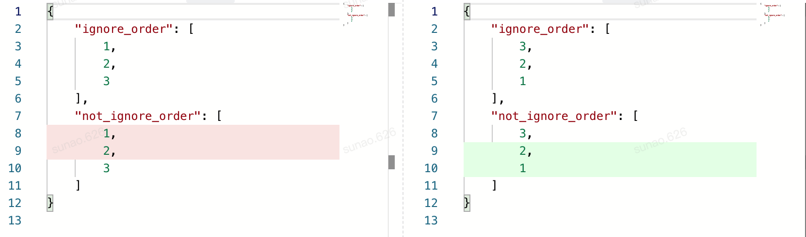
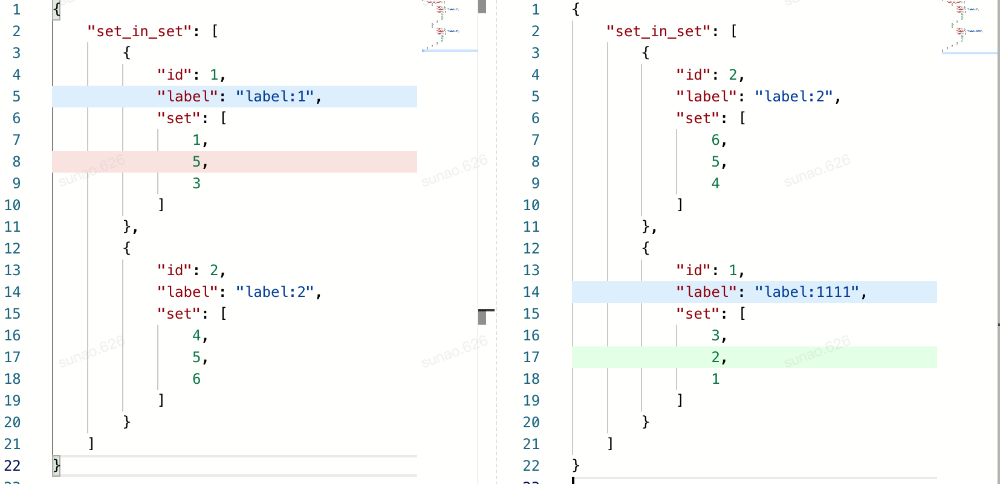

# JYCM


[](https://badge.fury.io/py/jycm)
[](https://coveralls.io/github/eggachecat/jycm?branch=master)

A flexible json diff framework for minimalist.

JYCM = Json You-Cha-Ma (「is there a difference」in Chinese)

# Reference
- [deepdiff](https://github.com/seperman/deepdiff)
    - how results are reported in JYCM is learnt from this amazing framework.
    - how TreeLevel is designed in JYCM is learnt from this amazing framework.
    
- [gojsondif](https://github.com/yudai/gojsondiff)
    - Fuzzy matching part of JYCM is learnt from this amazing framework.

# Install
> pip install jycm

# [Document](https://jycm.readthedocs.io/en/latest/index.html)

# Show cases

Here's some examples showing you what you can do with JYCM.
Only the results without configuration are shown below. (in case you wonder why things are not consistence here)


## Default behaviour
### Code

```python
from jycm.helper import make_ignore_order_func
from jycm.jycm import YouchamaJsonDiffer

left = {
    "a": 1,
    "b": 2,
    "d": "12345",
    "f": False,
    "e": [
        {"x": 1, "y": 1},
        {"x": 2, "y": 2},
        {"x": 3, "y": 3},
        {"x": 4, "y": 4},
    ]
}

right = {
    "a": 1,
    "b": 3,
    "c": 4,
    "f": True,
    "e": [
        {"x": 0, "y": 1},
        {"x": 2, "y": 2},
        {"x": 3, "y": 3},
        {"x": 5, "y": 5},
    ]
}

ycm = YouchamaJsonDiffer(left, right)
ycm.diff()

expected = {
    'dict:add': [
        {'left': '__NON_EXIST__',
         'left_path': '',
         'right': 4,
         'right_path': 'c'}
    ],
    'dict:remove': [
        {'left': '12345',
         'left_path': 'd',
         'right': '__NON_EXIST__',
         'right_path': ''}
    ],
    'list:add': [
        {'left': '__NON_EXIST__',
         'left_path': '',
         'right': {'x': 5, 'y': 5},
         'right_path': 'e->[3]'}
    ],
    'list:remove': [
        {'left': {'x': 4, 'y': 4},
         'left_path': 'e->[3]',
         'right': '__NON_EXIST__',
         'right_path': ''}
    ],
    'value_changes': [
        {'left': 2,
         'left_path': 'b',
         'new': 3,
         'old': 2,
         'right': 3,
         'right_path': 'b'},
        {'left': 1,
         'left_path': 'e->[0]->x',
         'new': 0,
         'old': 1,
         'right': 0,
         'right_path': 'e->[0]->x'},
        {'left': False,
         'left_path': 'f',
         'new': True,
         'old': False,
         'right': True,
         'right_path': 'f'}
    ]
}
assert ycm.to_dict(no_pairs=True) == expected

```
### Graph


## Ignore Order
### Code
```python
from jycm.helper import make_ignore_order_func
from jycm.jycm import YouchamaJsonDiffer

left = {
    "ignore_order": [1, 2, 3],
    "not_ignore_order": [1, 2, 3]
}

right = {
    "ignore_order": [3, 2, 1],
    "not_ignore_order": [3, 2, 1]
}

ycm = YouchamaJsonDiffer(left, right, ignore_order_func=make_ignore_order_func([
    "^ignore_order$"
]))
ycm.diff()
expected = {
    'list:add': [
        {'left': '__NON_EXIST__',
         'left_path': '',
         'right': 2,
         'right_path': 'not_ignore_order->[1]'},
        {'left': '__NON_EXIST__',
         'left_path': '',
         'right': 1,
         'right_path': 'not_ignore_order->[2]'}
    ],
    'list:remove': [
        {'left': 1,
         'left_path': 'not_ignore_order->[0]',
         'right': '__NON_EXIST__',
         'right_path': ''},
        {'left': 2,
         'left_path': 'not_ignore_order->[1]',
         'right': '__NON_EXIST__',
         'right_path': ''}
    ]
}
assert ycm.to_dict(no_pairs=True) == expected
```
### Graph



## Diff set-in-set
### Code
```python
from jycm.helper import make_ignore_order_func
from jycm.jycm import YouchamaJsonDiffer

left = {
    "set_in_set": [
        {
            "id": 1,
            "label": "label:1",
            "set": [
                1,
                5,
                3
            ]
        },
        {
            "id": 2,
            "label": "label:2",
            "set": [
                4,
                5,
                6
            ]
        }
    ]
}


right = {
    "set_in_set": [
        {
            "id": 2,
            "label": "label:2",
            "set": [
                6,
                5,
                4
            ]
        },
        {
            "id": 1,
            "label": "label:1111",
            "set": [
                3,
                2,
                1
            ]
        }
    ]
}


ycm = YouchamaJsonDiffer(left, right, ignore_order_func=make_ignore_order_func([
    f"^set_in_set$",
    f"^set_in_set->\\[\\d+\\]->set$"
]))

ycm.diff()


expected = {
    'list:add': [
        {'left': '__NON_EXIST__', 'right': 2, 'left_path': '', 'right_path': 'set_in_set->[1]->set->[1]'}
    ],
    'list:remove': [
        {'left': 5, 'right': '__NON_EXIST__', 'left_path': 'set_in_set->[0]->set->[1]', 'right_path': ''}
    ],
    'value_changes': [
        {'left': 'label:1', 'right': 'label:1111', 'left_path': 'set_in_set->[0]->label',
         'right_path': 'set_in_set->[1]->label', 'old': 'label:1', 'new': 'label:1111'}
    ]
}

assert ycm.to_dict(no_pairs=True) == expected

```

### Graph 



## Custom operator

### Define an operator
```python
import math
from jycm.operator import  BaseOperator

class L2DistanceOperator(BaseOperator):
    __operator_name__ = "operator:l2distance"
    __event__ = "operator:l2distance"

    def __init__(self, path_regex, distance_threshold):
        super().__init__(path_regex=path_regex)
        self.distance_threshold = distance_threshold

    def diff(self, level: 'TreeLevel', instance, drill: bool) -> Tuple[bool, float]:
        print("damn")
        distance = math.sqrt(
            (level.left["x"] - level.right["x"]) ** 2 + (level.left["y"] - level.right["y"]) ** 2
        )
        info = {
            "distance": distance,
            "distance_threshold": self.distance_threshold,
            "pass": distance < self.distance_threshold
        }

        if not drill:
            instance.report(self.__event__, level, info)
        return True, 1 if info["pass"] else 0
```
### And use it
```python

from jycm.jycm import YouchamaJsonDiffer

left = {
    "distance_ok": {
        "x": 1,
        "y": 1
    },
    "distance_too_far": {
        "x": 5,
        "y": 5
    },
}

right = {
    "distance_ok": {
        "x": 2,
        "y": 2
    },
    "distance_too_far": {
        "x": 7,
        "y": 9
    },
}

ycm = YouchamaJsonDiffer(left, right, custom_operators=[
    L2DistanceOperator(f"distance.*", 3),
])

expected = {
    'operator:l2distance': [
        {'left': {'x': 1, 'y': 1}, 'right': {'x': 2, 'y': 2}, 'left_path': 'distance_ok',
         'right_path': 'distance_ok', 'distance': 1.4142135623730951, 'distance_threshold': 3, 'pass': True},
        {'left': {'x': 5, 'y': 5}, 'right': {'x': 7, 'y': 9}, 'left_path': 'distance_too_far',
         'right_path': 'distance_too_far', 'distance': 4.47213595499958, 'distance_threshold': 3, 'pass': False}
    ]
}
assert {**ycm.to_dict(), "pairs": []} == expected


```

# Philosophy
Since determining two things are equal or not is heavily depend on the context, 
it is not possible to build a json diff tool to meet all requirements.  

JYCM choose another way: making it easy to compare values.

JYCM allows users just need to focus on defining the differing logic or what a distance is between
two values and 
JYCM will take care all the other dirty works such as array-item-matching, 
ignoring-array-order, recursively comparing and calculating similarity.

By the way, JYCM uses algorithms below to match items in array:

|            | exactly matching | fuzzy matching |
|:----------:|:--------:|:--------:|
| **with order** |    LCS  | Edit distance |
| **without order** |   Brute force   |  Kuhn–Munkres  |

Speaking of flexibility, to make a new operator, you just to need to extend a class called **BaseOperator** with such function signature:

```

diff: (level: 'TreeLevel', instance, drill: bool) => [float, boolean]

```

where the first return is a float number between zero and one for describing how similar **level.left** and **level.right** are and the second 
return is used to indicate whether comparing process should stop here.     


# Contribute

## requirements
```bash
pip install -r requirements-dev.txt
```

## Releases

```bash
git checkout master && git pull
bumpversion {patch|minor|major}
git push && git push --tags
```

## run test with cov
```bash
make testcov 
```

## make docs
```bash
make docs
```


