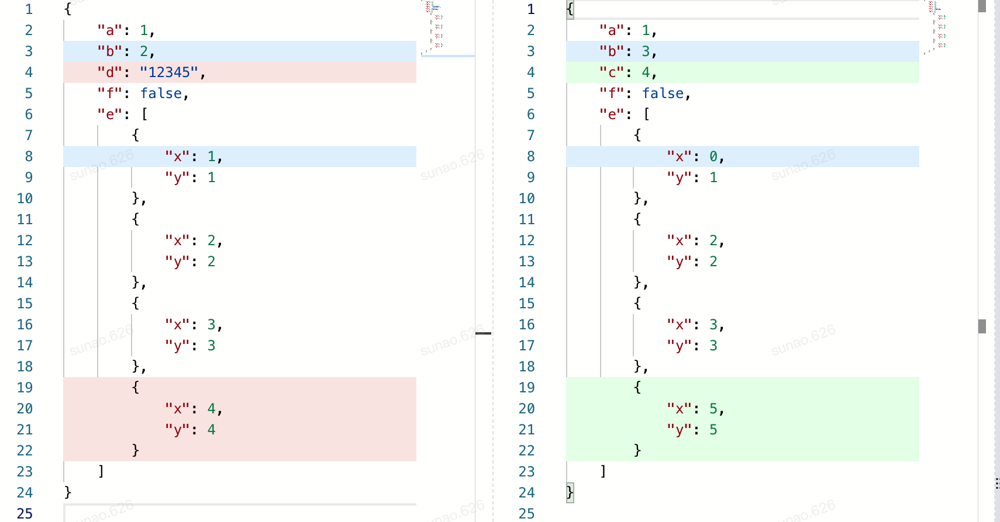
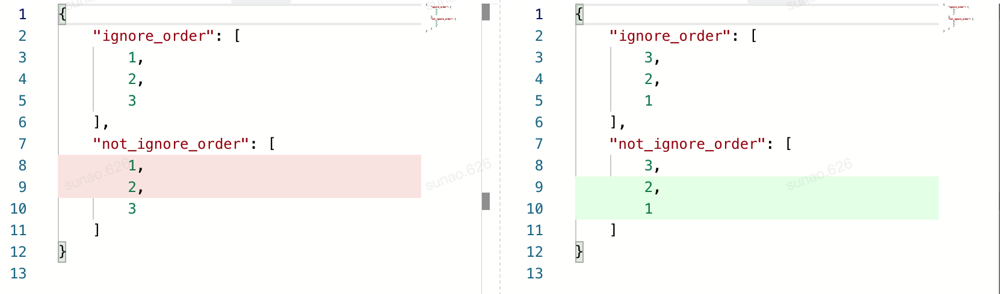

.. _example:

Usage and Examples
==================

Overview
--------

Usage
~~~~~
Basically all you need to diff two json with `JYCM` is as follow

::

    ycm = YouchamaJsonDiffer(left, right)
    ycm.diff()
    result = ycm.to_dict()

where

- `ycm = YouchamaJsonDiffer(left, right)` is used to setup the class;
    - you can specify other parameters to extend the ability of default ones.
    - usage parameters are shown in below
- `ycm.diff` is used to call the real `diff`
    - where the core diff functions are executed
- `ycm.to_dict` is used to get the result.
    - will return a dict
    - detail about the dict is explained right below

Return
~~~~~~
What `ycm.to_dict` return is a dict whose keys are names of the diff-events, and values are
list of dict which contains all relative info.

There's six default diff-events:

- `dict:add`
    - keys being inserted comparing the old one
- `dict:remove`
    - keys being removed comparing the old one
- `list:add`
    - item being inserted comparing the old one
    - using LCS to match
- `list:remove`
    - item being removed comparing the old one
    - using LCS to match
- `value_changes`
    - values being changed

All the relative info at least contains these keys:

- `left`
    - the paired old value
- `right`
    - the paired new value
- `left_path`
    - the paired old json path
- `right_path`
    - the paired new json path

when it comes old/new value does not exist (for example dict:add indicting old value on the json path does not exist)
a str `__NON_EXIST__` will be held.

Default behaviour
-----------------
These examples below will show the default behaviours when it comes to comparing two json values.
It will give you a sense what will be returned from the `YouchamaJsonDiffer.to_dict` after you call
`YouchamaJsonDiffer.diff`.

::

    left = {
        "a": 1,
        "b": 2,
        "d": "12345",
        "f": False,
        "e": [
            {"x": 1, "y": 1},
            {"x": 2, "y": 2},
            {"x": 3, "y": 3},
            {"x": 4, "y": 4},
        ]
    }

    right = {
        "a": 1,
        "b": 3,
        "c": 4,
        "f": True,
        "e": [
            {"x": 0, "y": 1},
            {"x": 2, "y": 2},
            {"x": 3, "y": 3},
            {"x": 5, "y": 5},
        ]
    }

    ycm = YouchamaJsonDiffer(left, right)
    ycm.diff()

    expected = {
        'dict:add': [
            {'left': '__NON_EXIST__',
             'left_path': '',
             'right': 4,
             'right_path': 'c'}
        ],
        'dict:remove': [
            {'left': '12345',
             'left_path': 'd',
             'right': '__NON_EXIST__',
             'right_path': ''}
        ],
        'list:add': [
            {'left': '__NON_EXIST__',
             'left_path': '',
             'right': {'x': 5, 'y': 5},
             'right_path': 'e->[3]'}
        ],
        'list:remove': [
            {'left': {'x': 4, 'y': 4},
             'left_path': 'e->[3]',
             'right': '__NON_EXIST__',
             'right_path': ''}
        ],
        'value_changes': [
            {'left': 2,
             'left_path': 'b',
             'new': 3,
             'old': 2,
             'right': 3,
             'right_path': 'b'},
            {'left': 1,
             'left_path': 'e->[0]->x',
             'new': 0,
             'old': 1,
             'right': 0,
             'right_path': 'e->[0]->x'},
            {'left': False,
             'left_path': 'f',
             'new': True,
             'old': False,
             'right': True,
             'right_path': 'f'}
        ]
    }
    assert ycm.to_dict(no_pairs=True) == expected

Above is the example of default behaviours. All the default events are shown and you can check if the results are as you expected.

For better understanding here's a graph of the diff result where the red stands for "remove" and the green stands for "insert" and blue stands for "change".
BTW I will release this rendering component soon

As you can see JYCM is smart: for example, it knows there's a *value_changes* on *e->[0]->[x]* and a remove on *e->[3]* of left and an insertion on *e->[3]* of right.

For more information, you can check the :ref:`Design`.

Ignore Order
------------
When it comes to set, things are getting interesting. :class:`YouchamaJsonDiffer` provides a parameter `ignore_order_func`
to determine whether the values comparing should ignore order or not.

You can use the helper function **make_ignore_order_func** from **ycm.helper** to make this function which takes into a list
of json path regax as parameters. Here's the example:

::

    left = {
        "ignore_order": [1, 2, 3],
        "not_ignore_order": [1, 2, 3]
    }

    right = {
        "ignore_order": [3, 2, 1],
        "not_ignore_order": [3, 2, 1]
    }

    ycm = YouchamaJsonDiffer(left, right, ignore_order_func=make_ignore_order_func([
        "^ignore_order$"
    ]))
    ycm.diff()
    expected = {
        'list:add': [
            {'left': '__NON_EXIST__',
             'left_path': '',
             'right': 2,
             'right_path': 'not_ignore_order->[1]'},
            {'left': '__NON_EXIST__',
             'left_path': '',
             'right': 1,
             'right_path': 'not_ignore_order->[2]'}
        ],
        'list:remove': [
            {'left': 1,
             'left_path': 'not_ignore_order->[0]',
             'right': '__NON_EXIST__',
             'right_path': ''},
            {'left': 2,
             'left_path': 'not_ignore_order->[1]',
             'right': '__NON_EXIST__',
             'right_path': ''}
        ]
    }
    assert ycm.to_dict(no_pairs=True) == expected

Abd here's the graph:

Default Operators
-----------------

There's some operators implemented in JYCM out of the box.

IgnoreOperator
~~~~~~~~~~~~~~

ExpectExistOperator
~~~~~~~~~~~~~~~~~~~

FloatInRangeOperator
~~~~~~~~~~~~~~~~~~~~

Custom Operators
----------------

Sometimes the distance function (or the function metering similarity) are more domain based.

For example, there's a json representing two points (named `distance_ok` and `distance_too_far`) on 2D space:

::

    left = {
        "distance_ok": {
            "x": 1,
            "y": 1
        },
        "distance_too_far": {
            "x": 5,
            "y": 5
        },
    }

    right = {
        "distance_ok": {
            "x": 2,
            "y": 2
        },
        "distance_too_far": {
            "x": 7,
            "y": 9
        },
    }

How on earth a diff framework would know if they are the same or not ? It is where `custom operator` kicks in.

You can define an operator as following:

::

    from jycm.operator import BaseOperator

    class L2DistanceOperator(BaseOperator):
        __operator_name__ = "operator:l2distance"
        __event__ = "operator:l2distance"

        def __init__(self, path_regex, distance_threshold):
            super().__init__(path_regex=path_regex)
            self.distance_threshold = distance_threshold

        def diff(self, level: 'TreeLevel', instance, drill: bool) -> Tuple[bool, float]:
            distance = math.sqrt(
                (level.left["x"] - level.right["x"]) ** 2 + (level.left["y"] - level.right["y"]) ** 2
            )
            info = {
                "distance": distance,
                "distance_threshold": self.distance_threshold,
                "pass": distance < self.distance_threshold
            }

            if not drill:
                instance.report(self.__event__, level, info)
            return True, 1 if info["pass"] else 0

Here's two things you should notice:

1. extends your class with  `BaseOperator` which is imported from jycm.operator module
2. implement a diff function whose signature is as above.

Here's more detail about the signature:

    - Parameters
        - **level** is the instance of :class:`TreeLevel` which is the base element being compared in JYCM

        - **instance** is the instance of :class:`YouchamaJsonDiffer` giving you full control of the process

            - normally calling  instance.report is enough
            - which is for reporting the diff event

        - **drill** is a bool function indicting whether this `diff` call is in reporting phase or not

            - drill is False when it is in the reporting phase
            - otherwise just a normal diff call (e.g. in the matching-items-in-array phase)

    - Return
        - the first is a bool which indicting whether the diff space should be stopped from this operator

            - an example is `ignore` which returns `True` since whether the `level` or its children are different or not is irrelevant

        - the second is a float number in [0,1] mapping the similarity of the `level.left` and `level.right`. 1 is for they being are same while 0 is for they being not the same at all.

            - **TIPS** similarity maybe different in drill phase. (for example, in the matching phase, two items in array who have the same `id` field are the same even though they are different in other fields which should be reported in the reporting phase)

then you can simply init your class and pass it in to the `custom_operators`

::

    ycm = YouchamaJsonDiffer(left, right, custom_operators=[
        L2DistanceOperator("distance.*", 3),
    ])

    ycm.diff()

    expected = {
        'operator:l2distance': [
            {
                'left': {'x': 1, 'y': 1},
                'right': {'x': 2, 'y': 2},
                'left_path': 'distance_ok',
                'right_path': 'distance_ok',
                'distance': 1.4142135623730951,
                'distance_threshold': 3,
                'pass': True
            },
            {
                'left': {'x': 5, 'y': 5},
                'right': {'x': 7, 'y': 9},
                'left_path': 'distance_too_far',
                'right_path': 'distance_too_far',
                'distance': 4.47213595499958,
                'distance_threshold': 3,
                'pass': False
            }
        ]
    }
    assert ycm.to_dict(no_pairs=True) == expected

Vola!
